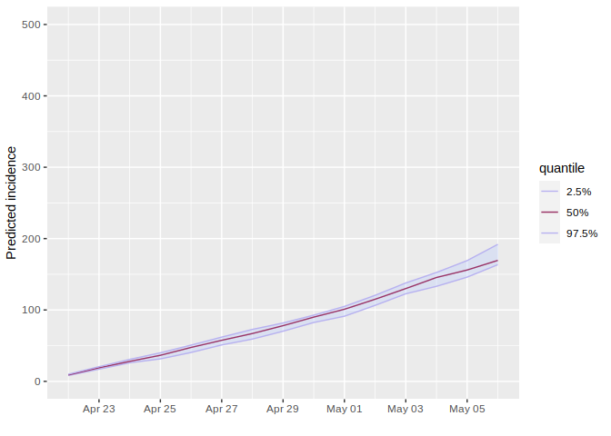
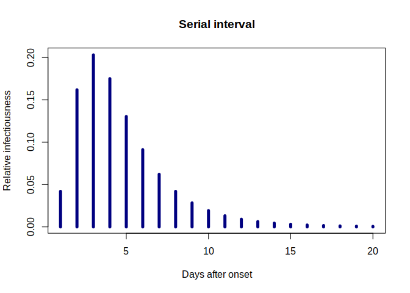
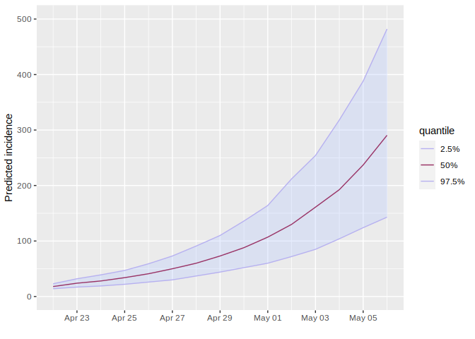

<!-- README.md is generated from README.Rmd. Please edit that file -->

# bedoc

<!-- badges: start -->

[](https://www.repostatus.org/#wip)
[](https://www.tidyverse.org/lifecycle/#maturing)
[](https://github.com/tjtnew/bedoc/actions)
[](https://CRAN.R-project.org/package=bedoc)
[](https://codecov.io/gh/tjtnew/bedoc?branch=master)
<!-- badges: end -->

> Hospital Bed Occupancy Forecasting

`bedoc` implements forecasting of daily bed occupancy from input data on
daily admissions and the distribution of duration of stay. It aims to
provide a reliable and standardised approach to forecasting that will
help improve the quality and ease of provision of predictions going
forward.

## Installing the package

Whilst this package is not yet on cran, the development version can be
installed using `devtools`:

``` r
devtools::install_github("tjtnew/bedoc")
```

## Usage

Let’s consider a couple of examples where we some hospital admission
data and would like to predict the bed occupancy over the following two
weeks. For both examples we will consider an outbreak in it’s early
stages where weare expecting exponential growth in the number of cases.

First we must decide on a distribution to use for length of stay. For
this we will use a Weibull distribution and make use of and use the
`distcrete` package to transform it to a discrete distribution.

``` r
library(distcrete)
length_of_stay <-
    distcrete("weibull", shape = 1.1, scale = 7.4, w = 0.5, interval = 1)
```

### Example 1

Here we assume the disease has a doubling time of 7 days and initially
10 admissions.

``` r
library(projections)
initial_admissions <- 10 # day one
duration <- 14           # 2 weeks
growth_rate = log(2) / 7 # doubling time of 7 days

future_admissions <- round(
    initial_admissions * exp(growth_rate * (seq_len(duration))))

# convert to a projections object to use with the project_beds function
admissions <- build_projections(
    x = c(initial_admissions, future_admissions), 
    dates = Sys.Date() + 0:14)
```

We now have all the variables we need to make our forecast of bed
occupancy

``` r
library(bedoc)
library(ggplot2)
library(scales)
projection <- project_beds(x = admissions, 
                           r_los = length_of_stay, 
                           n_sims = 10)

plot(projection[[1]], quantiles = c(0.025, 0.5)) + 
    scale_x_date(breaks = breaks_pretty(10)) + 
    ylim(0, 500)
```



### Example 2

This time we assume we have a weeks worth of admission dataa nd again
want to forecast the next 14 days. This time, however, we would like to
encorporate some knowledge of the disease serial-interval and a value of
R0 = 2.5.

To start with we make up some toy admissions data and create a
discretised serial interval. To give the example some some grounding in
reality we use an example from the recent COVID-19 pandemic. In a small
[study](https://www.ijidonline.com/article/S1201-9712\(20\)30119-3/fulltext)
it was observed that a log-normal distribution provided a good fit for
data that had an observed mean of 4.7 days and standard deviation of 2.9
days.

``` r
library(incidence)

# make some fake admissions data
initial_admissions <- sample(Sys.Date() - 0:7, 30, replace = TRUE)
initial_admissions <- incidence(initial_admissions)

# observed values need converting to use with R's log-normal function
recorded_mean <- 4.7
recorded_sd <- 2.9
mu <- log(recorded_mean^2 / sqrt(recorded_mean^2 + recorded_sd^2))
sd = sqrt(log(1 + recorded_sd^2 / recorded_mean^2))

# generate the discretised serial inteval
serial_interval <- distcrete::distcrete("lnorm", mu, sd, w = 0.5, interval = 1)
plot(1:20, serial_interval$d(1:20), type = "h", lwd = 5, col = "navy",
     main = "Serial interval", xlab = "Days after onset",
     ylab = "Relative infectiousness")
```



``` r

# project future admissions
future_admissions <- projections::project(initial_admissions, 
                                          R = c(2,2.5), si = serial_interval, 
                                          n_days = 14, n_sim = 100)

# combine the current and future admissions data
original_admissions <- build_projections(initial_admissions$counts,
                                        initial_admissions$dates)
admissions <- future_admissions + original_admissions
```

Now we can again make our forecasts

``` r
projections <- project_beds(x = admissions, 
                           r_los = length_of_stay, 
                           n_sims = 10)

projections <- merge_projections(projections)
projections <- subset(projections, from = Sys.Date())

plot(projections, quantiles = c(0.025, 0.5)) + 
    scale_x_date(breaks = breaks_pretty(10)) + 
    ylim(0, 500)
```


